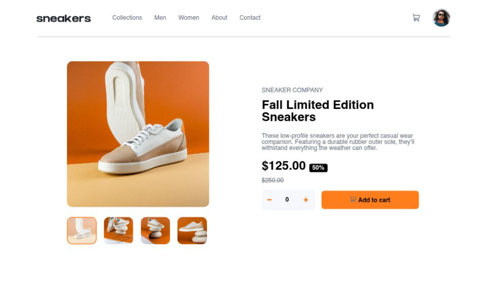

# Frontend Mentor - E-commerce product page solution

This is a solution to the [E-commerce product page challenge on Frontend Mentor](https://www.frontendmentor.io/challenges/ecommerce-product-page-UPsZ9MJp6). Frontend Mentor challenges help you improve your coding skills by building realistic projects.

## Table of contents

- [Overview](#overview)
  - [The challenge](#the-challenge)
  - [Screenshot](#screenshot)
  - [Links](#links)
- [My process](#my-process)
  - [Built with](#built-with)
  - [What I learned](#what-i-learned)
  - [Continued development](#continued-development)
  - [Useful resources](#useful-resources)
  - [AI Collaboration](#ai-collaboration)
- [Author](#author)

**Note: Delete this note and update the table of contents based on what sections you keep.**

## Overview

### The challenge

Users should be able to:

- View the optimal layout for the site depending on their device's screen size
- See hover states for all interactive elements on the page
- Open a lightbox gallery by clicking on the large product image
- Switch the large product image by clicking on the small thumbnail images
- Add items to the cart
- View the cart and remove items from it

### Screenshot




### Links

- Solution URL: [https://github.com/Daveed-dev/E-Commerce.git](https://your-solution-url.com)
- Live Site URL: [https://e-commerce-rho-ashen-63.vercel.app/](https://your-live-site-url.com)

## My process

### Built with

- Semantic HTML5 markup
- CSS custom properties
- Flexbox
- CSS Grid
- Mobile-first workflow
- Javascript

### What I learned

Use this section to recap over some of your major learnings while working through this project. Writing these out and providing code samples of areas you want to highlight is a great way to reinforce your own knowledge.

To see how you can add code snippets, see below:

```html
<noscript
      >This is not displaying because you have disabled Javascript in Your
      Browser</noscript
```

```css
:root {
  --clOrange: hsl(26, 100%, 55%);
  --paleOrange: hsl(25, 100%, 94%);
  --clWhite: hsl(0, 0%, 100%);
  --grayishBlue: hsl(220, 14%, 75%);
  --lightgrayishBlue: hsl(223, 64%, 98%);
  --darkgrayishBlue: hsl(219, 9%, 45%);
  --clBlack: hsl(0, 0%, 0%);
  --darkBlue: hsl(220, 13%, 13%);
}
```

````js
const proudOfThisFunc = () => {
  console.log('🎉');
};
const isMobile = window.matchMedia('(max-width: 500px)').matches; ```


### Continued development

I would love to work on a hepe E-commerce website

### Useful resources

- [https://wakatime.com] I used wakaTime to monitor my work progress and each time i spent on a particular file
-[https://github.com] I used GitHub to track every Feature i implement into the Project

### AI Collaboration

- [Claude.ai] claude helped with logic e.g the Slider Logic.
- [ChatGPT.ai] chat helped with building UI e.g the width to use for a particular element. How to position an element.

## Author

- Website - [Ojekunle David-joy](https://t.co/AGtx2WHxV2)
- Frontend Mentor - [@Daveed-dev](https://www.frontendmentor.io/profile/Daveed-dev)
- Twitter - [@David_JoyDD](https://x.com/David_JoyDD)


````
